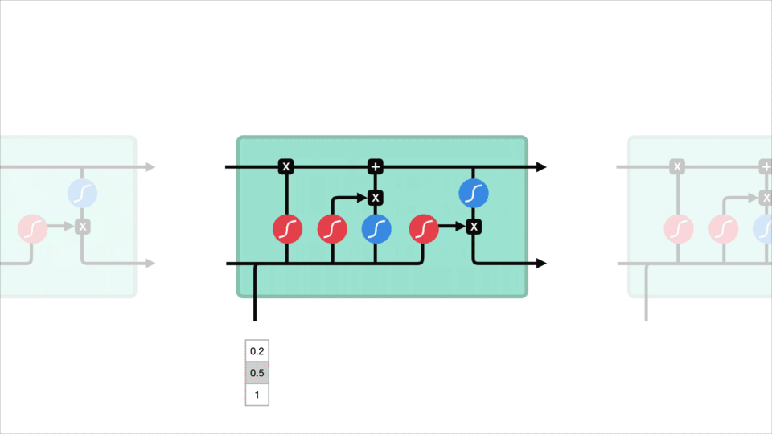

### Implementação
A implementação consiste em uma rede neural para o *forecast* do valor dos ativos definidos, com a arquitetura LSTM. O modelo foi projetado para realizar predições de curto prazo devido às características da arquitetura LSTM.

---

### O que é uma LSTM  
A LSTM (Long Short-Term Memory) é uma arquitetura de redes neurais recorrentes (RNN) especialmente projetada para modelar sequências temporais e lidar com problemas de gradiente desaparecente durante o treinamento. Diferente das RNNs tradicionais, a LSTM possui um mecanismo interno chamado "célula de memória", que utiliza um conjunto de portas (esquecimento, entrada e saída) para controlar o fluxo de informações.  

Essas portas são compostas por camadas sigmoide que regulam quais informações devem ser armazenadas, esquecidas ou usadas para gerar a saída. A porta de esquecimento decide quais informações anteriores descartar, enquanto a porta de entrada atualiza o estado da célula com novas informações relevantes. Por fim, a porta de saída regula quais partes do estado da célula serão utilizadas como saída. Isso permite que a LSTM retenha dependências de longo prazo em sequências, sendo ideal para problemas como séries temporais, processamento de linguagem natural e previsões financeiras.

*Demonstração do funcionamento interno da LSTM, como detalhado em [1].*

---

### Como funciona o forecast de ações com a LSTM  
O forecast de ações com uma LSTM segue um fluxo composto pelas seguintes etapas técnicas:  

1. **Pré-processamento dos dados**  
   Os dados históricos das ações, como preços de abertura, fechamento, volume de negociação e outros indicadores financeiros, são normalizados (por exemplo, usando escalonamento Min-Max) para melhorar o treinamento do modelo. Os dados são então convertidos em sequências de entrada e saída, geralmente usando janelas deslizantes para criar pares `X` (entradas) e `y` (saídas previstas).  

2. **Estrutura da LSTM**  
   O modelo é configurado com uma ou mais camadas LSTM, que processam as sequências temporais. Para capturar padrões complexos, é comum incluir camadas densas totalmente conectadas após as camadas LSTM. A configuração do modelo pode incluir hiperparâmetros como número de unidades LSTM, tamanho da sequência de entrada, número de camadas e função de ativação.  

3. **Treinamento do modelo**  
   Durante o treinamento, a LSTM ajusta os pesos das conexões usando o algoritmo de retropropagação através do tempo (BPTT). A função de perda comumente utilizada é o erro quadrático médio (MSE), que mede a diferença entre os valores previstos e os valores reais. Um otimizador, como Adam, é usado para minimizar a perda e atualizar os pesos.

4. **Previsão**  
   Após o treinamento, o modelo recebe sequências temporais de entrada e produz as previsões para o próximo passo de tempo. Para previsões de múltiplos passos, é possível usar estratégias como predição iterativa (usando as previsões anteriores como entradas) ou criar um modelo específico para prever vários passos de uma vez.  

A principal força da LSTM está na sua habilidade de capturar dependências temporais não-lineares e complexas nos dados, tornando-a uma ferramenta poderosa para previsão de séries temporais financeiras.

---

### Por que LSTMs funcionam melhor no curto prazo:
#### Memória de longo prazo limitada:
Embora as LSTMs sejam projetadas para lidar com dependências de longo prazo, na prática, sua capacidade de capturar essas dependências diminui à medida que a sequência temporal se estende. Isso acontece porque mesmo com mecanismos de memória, ruídos e erros acumulam-se durante o aprendizado e a inferência.

#### Dados recentes dominam o padrão:
Previsões de curto prazo dependem mais fortemente de padrões recentes nos dados (como tendências semanais ou diárias), que são mais fáceis de aprender para uma LSTM. As informações relevantes para o curto prazo geralmente permanecem no alcance da "janela de memória" da LSTM.

#### Complexidade dos padrões de longo prazo:
Para previsões de longo prazo, os padrões podem ser influenciados por fatores sazonais, econômicos ou estruturais que estão além do que uma LSTM treinada apenas com dados históricos pode captar.

---

## Referências Bibliográficas

1. **Towards Data Science**. *Illustrated Guide to LSTMs and GRUs: A step by step explanation*. Disponível em: [https://towardsdatascience.com/illustrated-guide-to-lstms-and-gru-s-a-step-by-step-explanation-44e9eb85bf21](https://towardsdatascience.com/illustrated-guide-to-lstms-and-gru-s-a-step-by-step-explanation-44e9eb85bf21). 